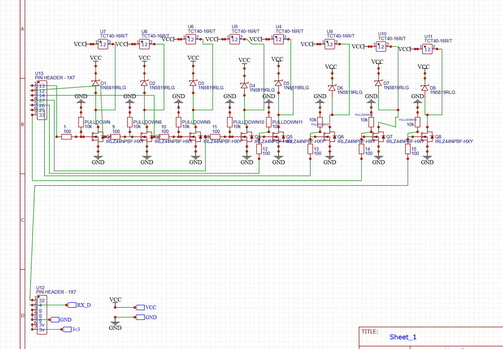
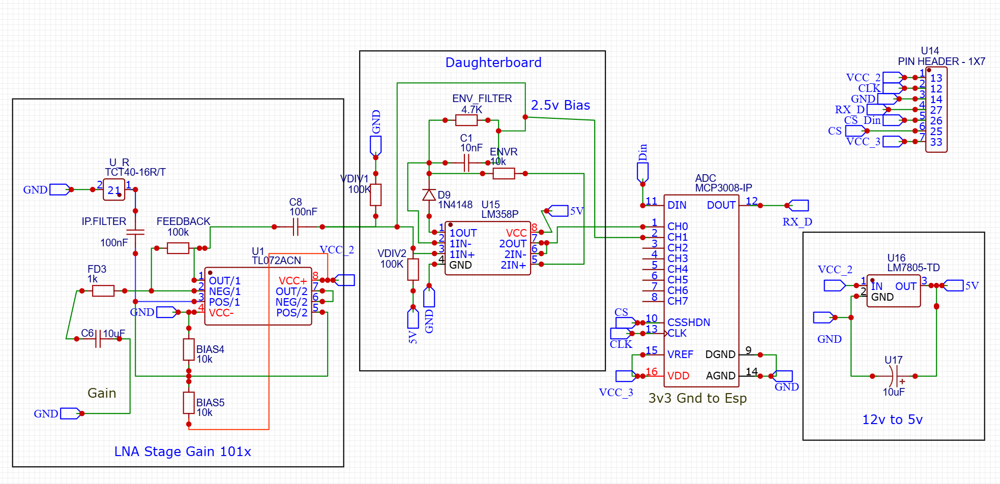

# 🔊 Ultrasound Phased Array for 2D Acoustic Imaging
 
[](https://opensource.org/licenses/MIT)
[](https://www.espressif.com/)
[](https://en.wikipedia.org/wiki/Ultrasound)
[](#)
 
> A servo-free 2D acoustic imaging system using beamforming with an 8-transmitter, 1-receiver ultrasonic phased array. No moving parts—just pure electronic beam steering at the microsecond level.
 

 
---
 
## 📋 Table of Contents
 
- [Overview](#-overview)
- [Hardware Architecture](#-hardware-architecture-v10)
- [Assembly & Testing Guide](#-hardware-assembly--testing-guide-v10)
- [Software & Theory](#-software--theory)
- [Getting Started](#-getting-started)
- [Project Specifications](#-project-specifications)
- [Future Work](#-future-work)
- [Contributing](#-contributing)
- [License](#-license)
- [Acknowledgments](#-acknowledgments)
- [Contact](#-contact-for-collaboration)
---
 
## 🚀 Overview
 
This project demonstrates a **servo-free 2D acoustic imaging system** using electronic beamforming. By controlling microsecond-level phase delays in an 8-element transmitter array, the acoustic beam is steered electronically to detect and image objects without any mechanical moving parts.
 
### Key Features
 
✨ **No Moving Parts** — Pure electronic beam steering  
🎯 **Real-Time Imaging** — Live 2D object detection  
⚡ **High Precision** — Microsecond-level phase control  
🔌 **Open Source** — Fully documented hardware & software  
📊 **Mixed-Signal Design** — Isolated TX and RX paths for clean signals  
 
---
 
## 🛠️ Hardware Architecture (V1.0)
 
The V1.0 system employs a **Mixed-Signal architecture** that physically separates the high-current transmitter array from the sensitive receiver stage.
 
### Component List
 
| Component | Specification | Quantity | Purpose |
|-----------|---------------|----------|---------|
| **Microcontroller** | NodeMCU ESP32 | 1 | Main control & timing |
| **Transmitters** | TCT40-16T (40kHz) | 8 | Acoustic beam generation |
| **Receiver** | TCT40-16R (40kHz) | 1 | Echo detection |
| **Op-Amp** | TL072 JFET-Input | 1 | Low-noise amplification |
| **ADC** | MCP3008 (10-bit SPI) | 1 | Linear data acquisition |
| **MOSFET Driver** | IRLZ44N Logic-Level | 8 | 12V pulse switching |
| **Schottky Diodes** | 1N5819 | 8 | Flyback protection & envelope detection |
| **Passives** | 100Ω, 10kΩ resistors, capacitors | Multiple | Filtering & biasing |
 
### Functional Block Diagram
 
```
┌─────────────────────────────────────────────────────────────┐
│                        ESP32 MCU                             │
│              (Timing & Beamforming Logic)                    │
└──────┬──────────────────────────────────────────────┬────────┘
       │                                              │
       ▼                                              ▼
┌──────────────────────┐                    ┌────────────────────────┐
│   TX Driver Stage    │                    │   RX Receiver Stage    │
│  (IRLZ44N MOSFETs)   │                    │  (TL072 LNA + Diodes)  │
│   8 × 12V Drivers    │                    │  (MCP3008 ADC)         │
└──────────────────────┘                    └────────────────────────┘
       │                                              │
       ▼                                              ▼
┌──────────────────────┐                    ┌────────────────────────┐
│  TX Array (8×)       │◄──────Acoustic──────►│  RX Element (1×)       │
│  TCT40-16T 40kHz     │      Coupling       │  TCT40-16R 40kHz       │
└──────────────────────┘                    └────────────────────────┘
```
 
### Circuit Schematics
 
| Transmitter (TX) Circuit | Receiver (RX) Circuit |
|:---:|:---:|
|  |  |
 
---
 
## 🏗️ Hardware Assembly & Testing Guide (V1.0)
 
### Phase 1: PCB Soldering
 
Solder components in order of **increasing height** to ensure the board remains flat and workable:
 
#### Step 1: Passives & Protection Diodes
1. Solder all 100Ω and 10kΩ resistors to their designated pads
2. Install 1N5819 Schottky diodes with careful polarity:
   - Silver stripe (cathode) must match PCB silkscreen markings
   - These diodes are critical for envelope detection sensitivity
#### Step 2: IC Sockets (Heat Protection)
⚠️ **CRITICAL:** Do not solder TL072 or MCP3008 ICs directly to the board.
 
- Solder **16-pin DIP sockets** for the TL072 op-amp
- Solder **8-pin DIP socket** for the MCP3008 ADC
- Insert ICs **after all high-heat soldering is complete** to prevent thermal damage
#### Step 3: Power & Driver Components
1. Solder IRLZ44N MOSFETs with proper gate resistor placement (100Ω)
2. Install decoupling capacitors near power pins
3. Mount screw terminals for external power connections
4. Solder ESP32 connection headers
#### Step 4: Transducers (Precision Step)
 
**TX Transducers (8×):**
- Solder flush to the PCB surface
- Ensure **perfect coplanarity** for accurate beamforming geometry
- Measure heights with a straightedge—variation > 1mm will degrade beam quality
**RX Transducer (1×):**
> ⚠️ **CRITICAL MECHANICAL INNOVATION:** 
> Do **NOT** solder the RX transducer flush to the PCB.
> 
> **Instead:**
> 1. Cut a small square (≈15mm × 15mm) from thick double-sided foam tape
> 2. Adhere it to the PCB where the RX element will mount
> 3. Solder the RX transducer on top of the foam pad
> 
> **Why?** This acoustic isolation eliminates "ringdown" from the TX array, reducing the blind zone from ~100ms to near-zero. The foam acts as an acoustic shock absorber.
 
---
 
### Phase 2: Star Ground Wiring Topology
 
**Critical for system stability and ESP32 protection.**
 
High-current TX switching creates electromagnetic interference that can destroy the sensitive RX and MCU stages. Use a **star ground architecture**:
 
#### Grounding Strategy
 
```
                    ┌─────────────────────┐
                    │   ESP32 GND Pin     │
                    └──────────┬──────────┘
                               │
                    ┌──────────┴──────────┐
                    │                     │
                    ▼                     ▼
            ┌──────────────┐      ┌──────────────┐
            │  TX Array    │      │  RX Board    │
            │  Ground      │      │  Ground      │
            └──────────────┘      └──────────────┘
            (Dirty 12V)           (Clean 12V)
```
 
#### Wiring Instructions
 
1. **TX Array Connection:**
   - Connect "Dirty" 12V supply to TX side only
   - Run a single **dedicated ground wire** from TX header to ESP32 `GND` pin
2. **RX Board Connection:**
   - Connect "Clean" 12V supply isolated from TX
   - Connect 3.3V from ESP32 to power MCP3008 ADC logic
   - Run a **separate ground wire** from RX header to the **same ESP32 `GND` pin**
3. **Golden Rule:** Never daisy-chain grounds. Both TX and RX must connect at a single point.
---
 
## 💻 Software & Theory
 
### Beamforming Mathematics
 
Electronic steering is achieved by introducing **time delays** to compensate for acoustic wave propagation across the array. The required delay for angle θ is:
 
$$\Delta t = \frac{d \cdot \sin(\theta)}{c}$$
 
**Where:**
- **d** = distance between transducer centers (e.g., 27mm for this array)
- **c** = speed of sound in air ≈ **343 m/s** (at 20°C)
- **θ** = target steering angle (0° = straight ahead, ±60° typical range)
**Example Calculation:**
For d = 27mm and θ = 30°:
$$\Delta t = \frac{0.027 \times \sin(30°)}{343} = \frac{0.027 \times 0.5}{343} ≈ 39.4 \text{ μs}$$
 
### Software Files
 
| File | Purpose | Language |
|------|---------|----------|
| `Arduino_Code/ultrasonic_array_shape.ino` | MCU firmware for pulse timing & ADC polling | C++ (Arduino) |
| `Python_Visualizer/shape_plotter.py` | Real-time visualization of echo data | Python 3 |
 
### Firmware Features
 
- **Microsecond Precision:** Hardware timers for accurate pulse sequencing
- **SPI Communication:** Fast polling of MCP3008 ADC at configurable rates
- **Dynamic Beamforming:** Real-time angle adjustment and data capture
- **Serial Output:** Raw echo data streamed to Python visualizer
### Python Visualization
 
- **Real-time 2D Display:** Live acoustic image updates
- **Adjustable Angle Range:** Sweep from -60° to +60°
- **Distance Calibration:** Convert echo delay to physical distance
- **Multi-angle Stacking:** Combine beams to form composite image
---
 
## 🚀 Getting Started
 
### Prerequisites
 
- **Hardware:** Assembled PCB with all components soldered (per Assembly Guide above)
- **ESP32 Dev Board:** Supported by Arduino IDE
- **Arduino IDE** v1.8.0 or later with ESP32 board support
- **Python 3.7+** with dependencies:
  ```bash
  pip install -r requirements.txt
  ```
 
### Installation Steps
 
1. **Clone the Repository**
   ```bash
   git clone https://github.com/saadw50/ultrasound_phased_array_for_2d_acustic_imaging.git
   cd ultrasound_phased_array_for_2d_acustic_imaging
   ```
 
2. **Firmware Setup**
   - Open Arduino IDE
   - Load `Arduino_Code/ultrasonic_array_shape.ino`
   - Select **Board:** NodeMCU-32S (ESP32)
   - Select **Port:** COM (Windows) or /dev/ttyUSB0 (Linux/Mac)
   - Click **Upload**
3. **Python Environment**
   ```bash
   cd Python_Visualizer
   pip install -r requirements.txt
   ```
 
4. **Run the Visualizer**
   ```bash
   python shape_plotter.py
   ```
   The visualizer will open and begin displaying 2D acoustic images from your phased array.
### Quick Test Checklist
 
- [ ] TX array transmits at 40kHz (verify with oscilloscope if available)
- [ ] RX signal appears on ADC (check serial monitor for values > 0)
- [ ] No ESP32 crashes or resets during operation
- [ ] Python plotter shows echo signals on screen
- [ ] Acoustic beam steers across ±60° range smoothly
---
 
## ⚙️ Project Specifications
 
### Electrical Specifications
 
| Parameter | Value | Notes |
|-----------|-------|-------|
| **Operating Frequency** | 40 kHz | Ultrasonic, above human hearing |
| **Transmit Power** | 12V @ 8 elements | Peak voltage to transducers |
| **Receiver Gain** | ~60 dB | TL072 LNA configuration |
| **ADC Resolution** | 10-bit | MCP3008 (linear, low-noise) |
| **ADC Sample Rate** | 100+ ksps | Configurable via SPI |
| **Beam Steering Range** | ±60° | Limited by array geometry |
| **Time Resolution** | ~3 μs | ESP32 timer precision |
 
### Acoustic Specifications
 
| Parameter | Value |
|-----------|-------|
| **Transducer Type** | Piezoelectric ceramic discs |
| **Operating Frequency** | 40 kHz ±1% |
| **Speed of Sound** | 343 m/s (air @ 20°C) |
| **Max Detectable Range** | ~3 meters | Limited by TX power & RX gain |
| **Minimum Blind Zone** | <10 cm | With foam-isolated RX |
| **Array Element Spacing** | 27 mm (8 TX + 1 RX) |
 
### Mechanical Specifications
 
| Component | Dimension | Material |
|-----------|-----------|----------|
| **PCB Size** | Custom (8×2 array layout) | FR-4 fiberglass |
| **TX Transducers** | Ø16 mm (diameter) | Ceramic composite |
| **RX Isolation Pad** | 15×15×3 mm | Double-sided foam tape |
| **Enclosure** | Open frame (recommended) | 3D printed or aluminum |
 
---
 
## 📊 Future Work
 
### Short-Term Goals (Immediate)
- [ ] Calibrate distance-to-delay math using MCP3008 ADC with known reference objects
- [ ] Improve RX signal filtering to reduce noise floor
- [ ] Optimize beamforming weighting (currently uniform; explore Hann/Hamming windows)
### Medium-Term Goals (Next 3–6 months)
- [ ] **Android Studio Integration** for mobile deployment
- [ ] **Google API Integration** for real-time cloud processing
- [ ] Develop hardware V2.0 with:
  - Phased RX array (multiple receivers for direction-of-arrival estimation)
  - Integrated power management
  - WiFi/Bluetooth for wireless data streaming
### Long-Term Goals (6–12 months)
- [ ] **COMSOL Simulation** of acoustic wave propagation and transducer crosstalk
- [ ] **Quantum Espresso DFT** modeling for piezoelectric material optimization
- [ ] Real-world application deployment:
  - Object detection and ranging (like LIDAR, but acoustic)
  - Gesture recognition
  - Wall stud detection for home automation
  - Underwater sonar adaptation
### Research Interests
- Advanced signal processing (matched filtering, compressed sensing)
- MIMO acoustic imaging with multiple RX elements
- Machine learning for shape classification from acoustic signatures
---
 
## 📦 Folder Structure
 
```
ultrasound_phased_array_for_2d_acoustic_imaging/
│
├── Arduino_Code/
│   └── ultrasonic_array_shape.ino          # ESP32 firmware
│
├── Python_Visualizer/
│   ├── shape_plotter.py                    # Real-time 2D plotting
│   └── requirements.txt                    # Python dependencies
│
├── hardware/
│   ├── tx_design.png                       # TX circuit schematic
│   ├── rx_design.png                       # RX circuit schematic
│   ├── schematic_diagram.png               # Full PCB schematic
│   └── wiring_diagram.pdf                  # Assembly wiring guide
│
├── images/
│   ├── 3D_image.jpg                        # Project banner
│   ├── demo_output_plot.png                # Sample visualizer output
│   └── hardware_setup_photo.jpg            # Physical assembly photo
│
├── docs/
│   ├── ASSEMBLY.md                         # Detailed assembly guide
│   ├── THEORY.md                           # Beamforming mathematics
│   └── TROUBLESHOOTING.md                  # Common issues & fixes
│
├── LICENSE                                 # MIT License
└── README.md                               # This file
```
 
---
 
## 🤝 Contributing
 
Contributions are welcome! Whether it's improving the beamforming algorithm, optimizing circuit design, or adding new features, your input is valuable.
 
### How to Contribute
 
1. **Fork the Repository**
   ```bash
   git clone https://github.com/YOUR_USERNAME/ultrasound_phased_array_for_2d_acoustic_imaging.git
   ```
 
2. **Create a Feature Branch**
   ```bash
   git checkout -b feature/your-feature-name
   ```
   Use descriptive names like `feature/add-receiver-array` or `bugfix/improve-noise-filtering`
3. **Make Your Changes**
   - Follow C/C++ and Python coding conventions
   - Comment your code thoroughly
   - Test on hardware if possible
4. **Commit & Push**
   ```bash
   git add .
   git commit -m "Description of your changes"
   git push origin feature/your-feature-name
   ```
 
5. **Submit a Pull Request**
   - Describe what you changed and why
   - Link any related issues
   - Include before/after performance comparisons if applicable
### Code Standards
 
- **C/C++:** Follow [Arduino style guide](https://www.arduino.cc/en/Reference/StyleGuide)
- **Python:** Follow [PEP 8](https://pep8.org/)
- **Comments:** Document complex logic with inline explanations
- **Testing:** Verify on hardware before submitting
### Reporting Issues
 
Found a bug? Please open an issue with:
- Clear description of the problem
- Steps to reproduce
- Expected vs. actual behavior
- Your hardware configuration and firmware version
---
 
## 📄 License
 
This project is licensed under the **MIT License**. You are free to use, modify, and distribute the code, provided you include the original copyright and license notice.
 
See the [LICENSE](LICENSE) file for full terms and conditions.
 
---
 
## 🙏 Acknowledgments
 
### Academic & Professional Support
- **Advisor:** [Md. Mahfuzul Haque](https://jstu.ac.bd/) — Jamalpur Science and Technology University (JSTU)
- **Institution:** Jamalpur Science and Technology University (JSTU), Bangladesh
- **Peers & Mentors:** Faculty and colleagues for invaluable feedback
### Technical & Community Support
- **AI Assistants** — Mixed-signal PCB layout auditing and troubleshooting
- **Open-Source Communities** — Inspiration from countless acoustic imaging projects
- **Academic Resources** — Beamforming theory and signal processing references
### Hardware & Manufacturing
- **PCB Fabrication:** JLCPCB (custom V1.0 PCB)
- **Component Sourcing:** Nilkhet Electronics Market, Dhaka
- **Tools & Software:** Arduino IDE, Python, KiCAD, MATLAB
---
 
## 📞 Contact for Collaboration
 
Have questions, ideas, or want to collaborate? Reach out!
 
| Method | Details |
|--------|---------|
| **Email** | shadebnywahid@gmail.com |
| **University Email** | s23111212@bsfmstu.ac.bd |
| **Facebook** | [facebook.com/saadw50](https://www.facebook.com/saadw50) |
| **Twitter** | [@saadw50](https://twitter.com/saadw50) |
| **GitHub** | [github.com/saadw50](https://github.com/saadw50) |
 
---
 
## 📈 Project Status
 
```
Phase 1: PCB Design & Fabrication     ✅ Complete
Phase 2: Component Assembly           ⏳ In Progress
Phase 3: Firmware Development         ⏳ In Progress
Phase 4: Testing & Calibration        ⏰ Upcoming
Phase 5: Android Integration          🔮 Planned
Phase 6: Hardware V2.0 Design         🔮 Planned
```
 
**Current Version:** V1.0 (Hardware assembled, firmware testing phase)
 
---
 
## ⭐ Show Your Support
 
If you find this project useful, please consider:
- Starring ⭐ this repository
- Following for updates
- Contributing improvements
- Sharing with others interested in acoustic imaging
---
 
**Last Updated:** May 2026  
**Maintainer:** [Md. Shahid Wadud](https://github.com/saadw50)  
**Repository:** [ultrasound_phased_array_for_2d_acoustic_imaging](https://github.com/saadw50/ultrasound_phased_array_for_2d_acustic_imaging)
 
