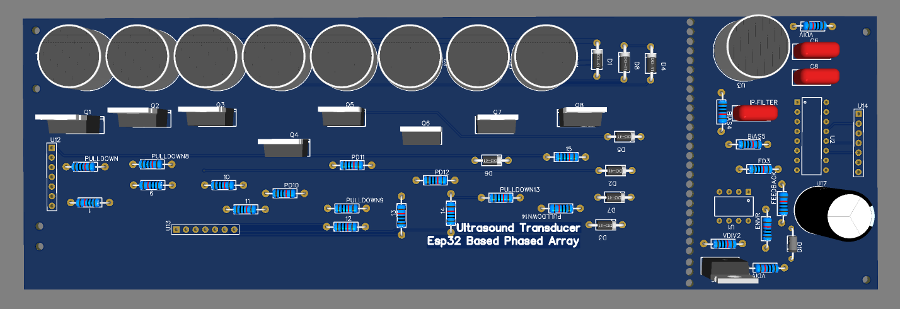

# 🔊 Ultrasound Phased Array for 2D Acoustic Imaging
 
[](https://opensource.org/licenses/MIT)
[](https://www.espressif.com/)
[](https://en.wikipedia.org/wiki/Ultrasound)
[](#)
 
> A servo-free 2D acoustic imaging system using electronic beamforming with an 8-transmitter, 1-receiver ultrasonic phased array. By utilizing microsecond-level phase delays, the system steers the acoustic beam electronically to image objects without mechanical motion.
 

 
---
 
## 📋 Table of Contents
 
- [Overview](#-overview)
- [Hardware Architecture (Mixed-Signal AFE)](#-hardware-architecture)
- [Assembly & Testing Guide](#-hardware-assembly--testing-guide)
- [Signal Processing Theory](#-signal-processing-theory)
- [Getting Started](#-getting-started)
- [Project Specifications](#-project-specifications)
- [Future Work](#-future-work)
- [Contributing](#-contributing)
- [License](#-license)
- [Acknowledgments](#-acknowledgments)
- [Contact](#-contact-for-collaboration)
---
 
## 🚀 Overview
 
This project implements a high-fidelity **Ultrasonic Phased Array** for 2D object mapping. The core innovation lies in the **Mixed-Signal Front-End (AFE)**, which employs high-headroom amplification and a precision active envelope detector to capture raw acoustic signatures with micro-volt sensitivity.
 
### Key Engineering Features
 
✨ **Electronic Beam Steering** — Servo-free directional sensing via microsecond phase-shifting.  
🎯 **Precision Rectification** — Active LM358-based envelope detection to eliminate the $V_f$ diode threshold.  
⚡ **Dual-Rail Isolation** — Separate $12\text{V}$ and $5\text{V}$ rails to maximize LNA headroom and ensure ADC safety.  
📊 **Pseudo-Differential Sampling** — Hardware-based common-mode noise rejection using MCP3008.  
🔌 **Star Ground Topology** — Minimized ground-loop interference between high-power TX and sensitive RX.
 
---
 
## 🛠️ Hardware Architecture
 
The system utilizes a multi-stage signal conditioning chain to transform raw $40\text{kHz}$ piezoelectric transducer output into a linear DC envelope.
 
### Component Specifications
 
| Component | Specification | Purpose |
|-----------|---------------|----------|
| **MCU** | ESP32 (WROOM) | Precise pulse timing & beamforming logic |
| **ADC** | MCP3008 (10-bit) | Linear data acquisition of the signal envelope |
| **LNA** | TL072 JFET Op-Amp | High-headroom pre-amplification (Powered by $12\text{V}$) |
| **Rectifier** | LM358 Op-Amp | Active precision half-wave rectification (Powered by $5\text{V}$) |
| **Transmitters**| TCT40-16T (x8) | Phased array elements for beam generation |
| **Receiver** | TCT40-16R (x1) | Wide-band echo acquisition |
| **MOSFETs** | IRLZ44N Logic-Level | High-speed $12\text{V}$ switching for TX pulses |
 
### Signal Flow Path
`TX Array` $\rightarrow$ `Acoustic Echo` $\rightarrow$ `TCT40-16R` $\rightarrow$ `TL072 LNA (12V Bias)` $\rightarrow$ `AC Coupling (100nF)` $\rightarrow$ `LM358 Active Rectifier (5V)` $\rightarrow$ `Low-Pass Envelope Filter` $\rightarrow$ `MCP3008 ADC` $\rightarrow$ `ESP32`
 
### Circuit Schematics
 
| Transmitter (TX) Circuit | Receiver (RX) Circuit |
|:---:|:---:|
|  |  |
 
---
 
## 🏗️ Hardware Assembly & Testing Guide
 
### Phase 1: PCB & AFE Assembly
Solder components in order of height to ensure a flat profile.
 
#### Step 1: The Pre-Amplifier Stage
- Install **TL072** in a DIP socket.
- Verify the $6.06\text{V}$ bias node ( junction of the $100\text{k}\Omega$ dividers).
- Ensure **VCC (Pin 8)** is connected to the dedicated $12\text{V}$ RX rail to avoid signal clipping.
#### Step 2: The Active Envelope Daughterboard
- Implement the **Precision Rectifier** using an LM358.
- Place the 1N4148 diode **inside the feedback loop** to eliminate the $0.6\text{V}$ drop.
- Set the envelope filter ($10\text{nF}$ and $100\text{k}\Omega$) to reference the $2.5\text{V}$ bias node, not ground.
#### Step 3: ADC Interface & Protection
- Install the **Series Coupling Capacitor** ($10\mu\text{F}$) to block DC bias from entering the MCP3008.
- Use a **$4.7\text{k}\Omega$ pull-down resistor** to establish a clean $0\text{V}$ baseline for the ADC.
- (Optional) Add a $3.3\text{V}$ Zener diode for hardware-level overvoltage protection.
#### Step 4: Transducer Mechanical Isolation
- **TX Elements:** Solder flush for perfect phase-center alignment.
- **RX Element:** Mount on a **foam isolation pad** to minimize structural "ringdown" and reduce the blind zone.
 
---
 
### Phase 2: Star Grounding Strategy
To prevent $12\text{V}$ switching noise from contaminating the $\mu\text{V}$ signals in the RX chain:
 
1. **TX Ground:** All MOSFET sources and TX transducer negatives connect to a dedicated "Dirty Ground."
2. **RX Ground:** All op-amp and ADC grounds connect to a "Clean Ground."
3. **Convergence:** Connect the Dirty Ground and Clean Ground **only at a single point** (the ESP32 GND pin).
---
 
## 💻 Signal Processing Theory
 
### Electronic Beamforming
Steering is achieved by calculating the time-of-flight difference across the linear array. For a target angle $\theta$, the delay $\Delta t$ for adjacent elements is:
 
$$\Delta t = \frac{d \cdot \sin(\theta)}{c}$$
 
**Parameters:**
- **d:** $27\text{mm}$ (inter-element spacing)
- **c:** $\approx 343\text{m/s}$ (speed of sound in air)
 
### Active Envelope Detection
Standard diode rectifiers introduce a nonlinear voltage drop ($\text{V}_f$), which kills sensitivity for distant targets. This system uses a **closed-loop precision rectifier**:
1. The op-amp compensates for the diode's $V_f$ by increasing its output.
2. The signal is passed through a **Low-Pass Filter ($\tau = 1\text{ms}$)**.
3. The resulting DC envelope represents the magnitude of the ultrasonic return, independent of the $40\text{kHz}$ carrier frequency.
 
### Software Implementation
- **Slew-Rate Optimized Sampling:** Fast SPI polling of the MCP3008 to capture the lauching edge of the echo.
- **Pseudo-Differential Logic:** Software subtraction of CH0 (Signal) and CH1 (Bias Reference) to achieve common-mode noise rejection.
---
 
## 🚀 Getting Started
 
### Prerequisites
- **Hardware:** Assembled V1.0 PCB with separate 12V/5V rails.
- **Environment:** Arduino IDE with ESP32 Board Support & Python 3.7+.
 
### Installation
1. **Clone the Repo**
   ```bash
   git clone https://github.com/saadw50/ultrasound_phased_array_for_2d_acustic_imaging.git
   ```
2. **Flash Firmware** $\rightarrow$ `Arduino_Code/ultrasonic_array_shape.ino`
3. **Run Visualization** $\rightarrow$ `python Python_Visualizer/shape_plotter.py`
---
 
## ⚙️ Project Specifications
 
| Parameter | Value | Engineering Note |
|-----------|-------|-------------------|
| **AFE Topology** | Hybrid TL072/LM358 | High Slew-Rate $\rightarrow$ Precision Rectifier |
| **RX Rail** | $12\text{V}$ DC | Maximizes LNA Headroom |
| **ADC Reference** | $3.3\text{V}$ / $5\text{V}$ | 10-bit Linear Resolution |
| **Beam Steering** | $\pm 60^\circ$ | Electronically controlled phase-shift |
| **Min Blind Zone** | $\approx 10\text{cm}$ | Reduced via foam acoustic isolation |
| **Resolution** | $\approx 3\mu\text{s}$ | Hardware timer precision |
 
---
 
## 📊 Future Work
- [ ] **Dynamic Apodization:** Implementing Hamming/Hanning windowing to reduce side-lobes in the beam pattern.
- [ ] **Adaptive Baseline Calibration:** Kalman filter implementation for real-time noise floor tracking.
- [ ] **Crosstalk Analysis:** COMSL simulation of piezoelectric element interaction.
- [ ] **MIMO Integration:** Expanding to multiple receivers for Triangulation.
---
 
## 🙏 Acknowledgments
- **Advisor:** [Md. Mahfuzul Haque](https://jstu.ac.bd/) — Jamalpur Science and Technology University (JSTU)
- **Institution:** Jamalpur Science and Technology University (JSTU), Bangladesh
- **Tools:** PADS PCB, KiCAD, Python (Matplotlib/NumPy)
 
---
 
**Last Updated:** July 2026  
**Maintainer:** [Shad Ebny Wahid](https://github.com/saadw50)