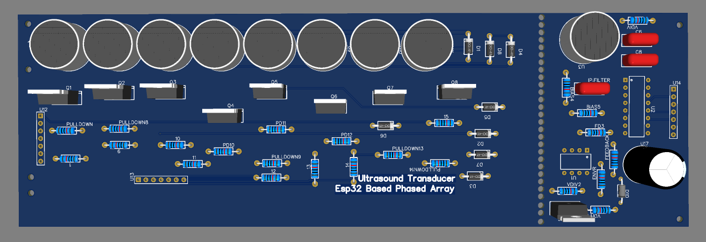
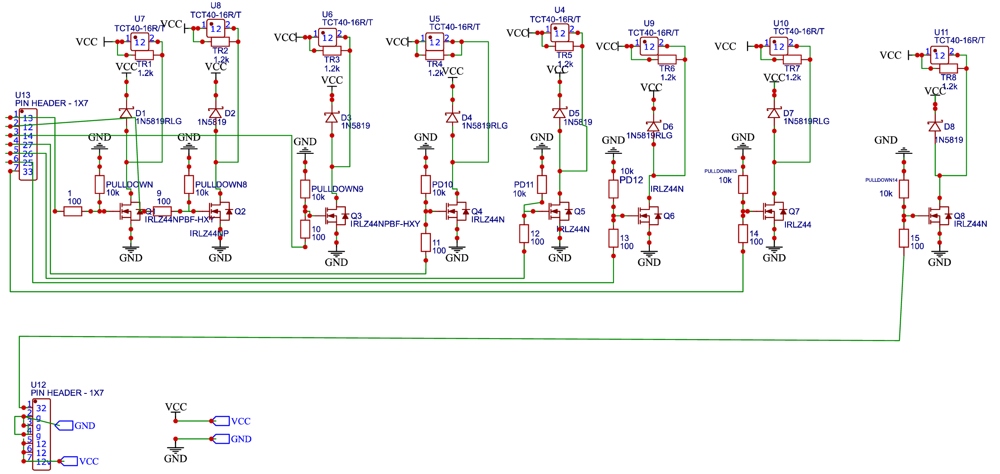
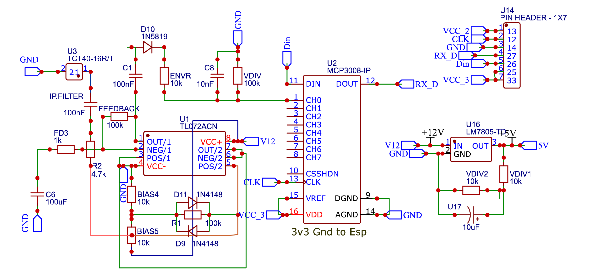

# 🔊 8-TX/1-RX Ultrasonic Array for Geometry-Aware Ranging and 2D Acoustic Imaging

[](https://opensource.org/licenses/MIT)
[](https://www.espressif.com/)
[](#)
[](#)

> A custom air-coupled ultrasonic sensing platform built around an **8-transmitter, 1-receiver array**, an ESP32, a TL072 analog front end, a Schottky envelope detector, and an MCP3008 ADC. The current prototype performs sequential multi-transmitter ranging and geometry-aware calibration. Electronic transmit beam steering and 2D acoustic mapping are the next development stages.



---

## 📋 Table of Contents

- [Project Status](#-project-status)
- [Overview](#-overview)
- [Validated Hardware Architecture](#-validated-hardware-architecture)
- [Signal Chain](#-signal-chain)
- [Pin Mapping](#-pin-mapping)
- [Measurement Method](#-measurement-method)
- [Calibration Dashboard](#-calibration-dashboard)
- [Experimental Results](#-experimental-results)
- [Beamforming Roadmap](#-beamforming-roadmap)
- [Getting Started](#-getting-started)
- [Project Specifications](#-project-specifications)
- [Limitations](#-limitations)
- [Future Work](#-future-work)
- [Acknowledgments](#-acknowledgments)
- [License](#-license)
- [Contact](#-contact)

---

## ✅ Project Status

### Completed

- [x] Custom 8-channel ultrasonic transmitter PCB
- [x] Eight independently controlled 40 kHz TX channels
- [x] Single TCT40-16R receive channel
- [x] TL072 analog front end operating from a 12 V rail
- [x] Schottky envelope detection using 1N5819
- [x] MCP3008 single-ended and pseudo-differential acquisition
- [x] ESP32 sequential TX scanning
- [x] Adaptive noise-floor thresholding
- [x] First-threshold-crossing and envelope-peak timing
- [x] Wi-Fi calibration dashboard with CSV logging
- [x] Indoor target detection from approximately 13 cm to about 3 m

### In Progress

- [ ] Final distance calibration using laboratory reference measurements
- [ ] Bistatic geometry correction for all TX-to-target-to-RX paths
- [ ] Per-channel timing and amplitude normalization
- [ ] Hardware-timed simultaneous TX burst generation
- [ ] Experimental transmit beam steering
- [ ] Polar beam-pattern measurement
- [ ] 2D acoustic target localization and mapping

> **Important:** The current firmware fires TX1–TX8 sequentially. This is a multi-transmitter or synthetic-aperture measurement mode, not yet true simultaneous phased-array beamforming.

---

## 🚀 Overview

The project investigates low-cost ultrasonic ranging and directional sensing using eight 40 kHz transmitters and one physically separate receiver. Each transmitter produces a controlled burst through a logic-level MOSFET driver. Echoes are amplified, rectified into an envelope, digitized by an MCP3008, and processed by an ESP32.

The present research focus is:

1. Characterizing channel-to-channel timing and amplitude variation.
2. Correcting the bistatic geometry created by the separated TX array and RX element.
3. Comparing single-ended and pseudo-differential ADC acquisition.
4. Developing a calibrated ranging model from known-distance laboratory data.
5. Extending the platform to electronically steered transmit beams.

### Key Engineering Features

- **Eight independent TX channels** using TCT40-16T elements.
- **Single wide-angle RX channel** using a TCT40-16R element.
- **12 V low-side MOSFET TX drivers** using IRLZ44N devices.
- **1.2 kΩ resistor across each TX transducer** for electrical reset and damping.
- **TL072 JFET-input analog front end** with a buffered mid-supply reference.
- **Approximately 23× AC gain near 40 kHz** with near-unity DC gain.
- **1N5819 Schottky envelope detector** for improved low-level sensitivity.
- **MCP3008 10-bit ADC** with single-ended and CH0+/CH1− pseudo-differential modes.
- **Star-ground strategy** to reduce coupling between the high-current TX section and sensitive RX section.
- **Wi-Fi browser interface** for parameter tuning, scanning, and CSV export.

---

## 🛠️ Validated Hardware Architecture

| Block | Component | Current Implementation |
|---|---|---|
| Microcontroller | ESP32-WROOM | TX control, SPI acquisition, Wi-Fi dashboard, timing and logging |
| ADC | MCP3008 | 10-bit, 3.3 V reference, approximately 2 MHz SPI |
| RX amplifier | TL072 | 12 V single-supply operation with buffered mid-supply bias |
| Envelope detector | 1N5819 + RC network | Passive Schottky rectification and envelope filtering |
| TX elements | 8 × TCT40-16T | Independently switched 40 kHz transmitters |
| RX element | 1 × TCT40-16R | Common echo receiver |
| TX switches | 8 × IRLZ44N | Low-side open-drain switching from ESP32 GPIOs |
| TX damping/reset | 8 × 1.2 kΩ | Connected across the individual TX transducers |
| Power | 12 V TX/RX rail + regulated logic rails | Shared supply with separated TX/RX grounding paths |

### Circuit Schematics

| Transmitter Circuit | Receiver Circuit |
|:---:|:---:|
|  |  |

---

## 🔁 Signal Chain

```text
ESP32 TX timing
      ↓
IRLZ44N low-side drivers
      ↓
8 × TCT40-16T transmitters
      ↓
Acoustic propagation and reflection
      ↓
TCT40-16R receiver
      ↓
AC coupling and TL072 input buffer
      ↓
TL072 40 kHz gain stage
      ↓
1N5819 Schottky envelope detector
      ↓
RC envelope filter
      ↓
MCP3008 CH0
      ↓
ESP32 SPI acquisition
      ↓
Threshold detection, peak analysis, calibration and CSV logging
```

### Receiver Front-End Notes

- The TL072 operates from a 12 V rail.
- A 10 kΩ/10 kΩ divider produces a mid-supply reference near 6 V.
- One TL072 section buffers the bias/reference node used by the signal path.
- The main amplifier uses a 22 kΩ feedback resistor and a frequency-dependent lower leg based on 1 kΩ and 100 nF.
- The resulting gain is close to unity at DC and approximately 23 near 40 kHz.
- The envelope output is kept within the MCP3008 input range.

---

## 🔌 Pin Mapping

### ESP32 to TX Array

| TX Channel | ESP32 GPIO |
|---:|---:|
| TX1 | GPIO13 |
| TX2 | GPIO12 |
| TX3 | GPIO14 |
| TX4 | GPIO27 |
| TX5 | GPIO26 |
| TX6 | GPIO25 |
| TX7 | GPIO33 |
| TX8 | GPIO32 |

### ESP32 to MCP3008

| MCP3008 Signal | ESP32 GPIO |
|---|---:|
| CS | GPIO5 |
| SCK | GPIO18 |
| DOUT / MISO | GPIO19 |
| DIN / MOSI | GPIO23 |
| VDD / VREF | 3.3 V |
| DGND / AGND | Ground |

### ADC Modes

- **Single-ended:** MCP3008 CH0 measures the envelope relative to ground.
- **Pseudo-differential:** CH0 is the positive input and CH1 is tied to MCP3008 analog ground as the negative reference.

The pseudo-differential mode reduces the baseline in short- and medium-range tests. Single-ended mode has produced stronger detection at the longest tested ranges.

---

## 📐 Measurement Method

Each scan performs the following sequence:

1. Measure the idle noise floor.
2. Calculate an adaptive threshold:

   ```text
   Threshold = NoiseMax + ThresholdMargin
   ```

3. Transmit a burst from one TX channel.
4. Wait through the configured RX blanking interval.
5. Sample the envelope during the RX window.
6. Record:
   - first validated threshold crossing,
   - envelope peak amplitude,
   - envelope peak time,
   - detection status,
   - raw distance estimate.
7. Repeat for TX1–TX8.

### Conventional Raw Distance

The initial range estimate is:

$$
d_{raw}=\frac{c\,t}{2}
$$

This equation assumes a colocated transmitter and receiver. The present array is **bistatic**, so the final model must account for the separate TX and RX positions:

$$
L_i = L_{TX_i\rightarrow target}+L_{target\rightarrow RX}
$$

The channel-dependent path geometry explains why the transmitters farthest from the receiver can report a larger apparent distance, particularly at close range.

---

## 🌐 Calibration Dashboard

The ESP32 hosts an HTML dashboard over Wi-Fi. It connects to a configured 2.4 GHz hotspot and provides:

- known-distance entry,
- single-ended or pseudo-differential ADC selection,
- threshold-margin adjustment,
- consecutive-sample requirement,
- burst-cycle selection,
- RX blanking and RX window adjustment,
- noise-measurement duration,
- TX settling time,
- sound-speed setting,
- TOF offset entry,
- single-scan and continuous-scan control,
- per-channel results,
- median distance and error display,
- browser-side CSV logging and download.

### Recommended Initial Calibration Configuration

```text
ADC mode             = Pseudo differential
Threshold margin     = 20 ADC counts
Consecutive samples  = 2
Burst cycles         = 8
RX blanking          = 300 us
RX window            = 12000 us
Noise measurement    = 2500-5000 us
TOF offset            = 0 us during data collection
```

For long-range ceiling measurements, longer bursts and a range-gated RX window are used.

---

## 📊 Experimental Results

The prototype has produced repeatable indoor measurements using flat targets and ceiling reflections.

### Current Observations

- Stable target detection has been demonstrated from approximately **13 cm to 196 cm**.
- A ceiling reflection at approximately **3 m** has also been detected.
- Short- and medium-range measurements show high scan-to-scan repeatability.
- A systematic distance offset remains before final calibration.
- TX7 and TX8 generally produce weaker or later responses because of their physical distance from the RX element.
- Single-ended and pseudo-differential modes are close at short and medium range.
- Single-ended mode currently gives the better detection probability at the longest tested distances.
- At very long range, fixed low-threshold first-crossing timing can detect the early shoulder of the envelope. Peak time or an adaptive fractional-threshold method is being evaluated.

### Preliminary Calibration Trend

Known-distance measurements show that most error is systematic rather than random. The final paper will compare:

1. Conventional $d=ct/2$ ranging.
2. Global linear calibration.
3. Per-channel calibration.
4. Bistatic geometry-aware calibration.

> Reported values are experimental prototype results, not final guaranteed specifications.

---

## 📡 Beamforming Roadmap

True transmit beam steering requires synchronized bursts with controlled element-to-element delay:

$$
\Delta t = \frac{d\sin(\theta)}{c}
$$

where:

- $d$ is the measured center-to-center TX spacing,
- $\theta$ is the desired steering angle,
- $c$ is the speed of sound.

At 40 kHz, one acoustic cycle is approximately 25 µs. Therefore, microsecond-level timing error can create a significant phase error. Final beam steering will use hardware-timed ESP32 peripherals rather than ordinary sequential `digitalWrite()` calls.

### Planned Beamforming Validation

- Measure the exact TX-element coordinates.
- Measure per-channel burst start-time and phase error on an oscilloscope.
- Generate synchronized phase-delayed bursts.
- Measure polar beam patterns over approximately −60° to +60°.
- Compare theoretical array factor, simulation and measured response.
- Report steering error, −3 dB beamwidth, sidelobes and grating lobes.
- Use coarse-to-fine angular scanning for 2D target localization.

Because the system has only one receiver, it supports **transmit beamforming**, not conventional multi-channel receive beamforming.

---

## 🚀 Getting Started

### Prerequisites

- Assembled custom TX/RX PCB
- ESP32 development board
- 12 V regulated supply
- MCP3008 ADC
- Arduino IDE with ESP32 board support
- A 2.4 GHz Wi-Fi hotspot for the calibration dashboard
- Oscilloscope and measuring tape for calibration

### Installation

1. Clone the repository:

   ```bash
   git clone https://github.com/saadw50/ultrasound_phased_array_for_2d_acustic_imaging.git
   cd ultrasound_phased_array_for_2d_acustic_imaging
   ```

2. Open the current ESP32 firmware in Arduino IDE.
3. Enter the Wi-Fi SSID and password used for calibration.
4. Select the correct ESP32 board and COM port.
5. Upload the firmware.
6. Open Serial Monitor at 115200 baud to obtain the ESP32 IP address.
7. Open the IP address or `http://ultrasonic.local` in a browser.
8. Collect CSV data without changing settings during one experiment.

### Suggested Repository Structure

```text
.
├── Arduino_Code/
│   ├── calibration_dashboard/
│   ├── sequential_scan/
│   └── beamforming_experiments/
├── hardware/
│   ├── tx_design.png
│   ├── rx_design.png
│   ├── pcb_images/
│   └── bom/
├── data/
│   ├── raw/
│   ├── calibration/
│   └── beam_patterns/
├── analysis/
│   ├── calibration_fit.py
│   ├── plots.py
│   └── notebooks/
├── docs/
│   ├── test_protocol.md
│   └── research_notes.md
├── 3D_image.png
├── LICENSE
└── README.md
```

---

## ⚙️ Project Specifications

| Parameter | Current Value | Status |
|---|---:|---|
| Operating frequency | 40 kHz | Validated |
| TX channels | 8 | Validated |
| RX channels | 1 | Validated |
| TX drive rail | 12 V | Validated |
| RX amplifier | TL072 | Validated |
| Envelope detector | 1N5819 Schottky + RC | Validated |
| ADC | MCP3008, 10-bit | Validated |
| ADC reference | 3.3 V | Validated |
| SPI clock | Approximately 2 MHz | Validated |
| Burst length | Adjustable, typically 8–32 cycles | Validated |
| ADC modes | Single-ended and pseudo-differential | Validated |
| Indoor detection range | Approximately 13 cm to 3 m | Experimental |
| Final calibrated accuracy | To be determined | In progress |
| Transmit beam steering | Planned | Not yet validated |
| 2D acoustic imaging | Planned | Not yet validated |

---

## ⚠️ Limitations

- The current system does not yet perform simultaneous phased transmission.
- The MCP3008 envelope channel does not preserve the phase of the received 40 kHz carrier.
- One receiver prevents conventional receive beamforming.
- The separate TX and RX positions create bistatic geometry that must be included in the final ranging model.
- Long-range readings are sensitive to the threshold estimator and indoor multipath reflections.
- Element spacing may produce grating lobes during beam steering; this must be measured experimentally.
- The present accuracy values are preliminary and should not be interpreted as certified metrology performance.

---

## 📈 Future Work

- [ ] Laboratory calibration at multiple known distances
- [ ] Temperature and humidity compensation
- [ ] Per-channel timing-offset estimation
- [ ] Per-channel amplitude normalization
- [ ] Bistatic geometry-aware ranging
- [ ] Adaptive fractional-threshold TOF estimation
- [ ] Raw-waveform acquisition using a higher-speed ADC
- [ ] ESP32 RMT or hardware-timer beamforming engine
- [ ] Polar beam-pattern measurement
- [ ] Coarse-to-fine adaptive angular scan
- [ ] 2D target localization
- [ ] Multiple-receiver extension for receive beamforming and triangulation
- [ ] Comparison with HC-SR04 and other low-cost ultrasonic sensors
- [ ] MATLAB/Python simulation-to-experiment validation

---

## 🙏 Acknowledgments

- **Advisor:** [Md. Mahfuzul Haque](https://jstu.ac.bd/) — Department of Electrical and Electronic Engineering, Jamalpur Science and Technology University
- **Institution:** Jamalpur Science and Technology University, Bangladesh
- **Tools:** Arduino IDE, ESP32, PADS/KiCad, Python, MATLAB, Processing and standard laboratory instruments

---

## 📄 License

This project is released under the [MIT License](LICENSE).

---

## 📬 Contact

**Maintainer:** [Shad Ebny Wahid](https://github.com/saadw50)  
**Project:** Ultrasound Phased Array for 2D Acoustic Imaging  
**Institution:** Jamalpur Science and Technology University, Bangladesh

---

**Last Updated:** August 2026
